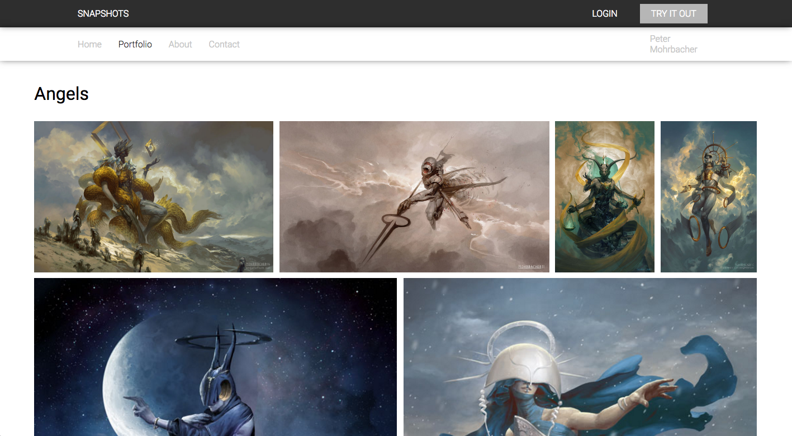
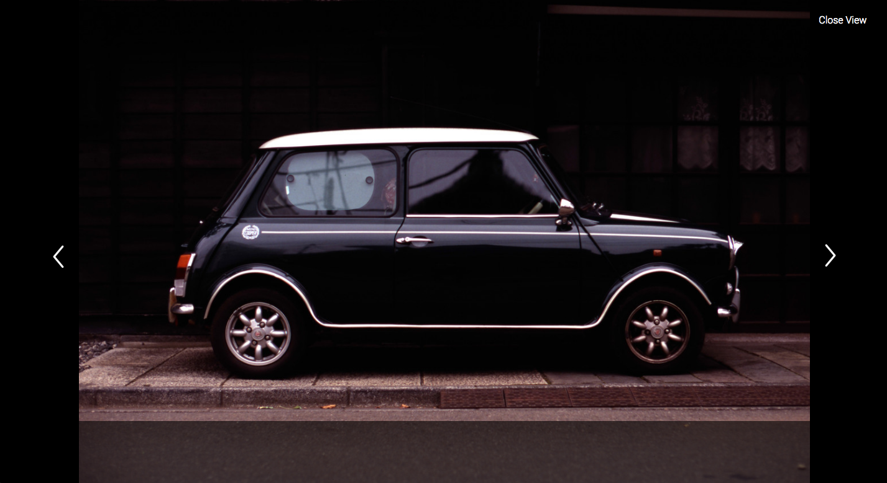
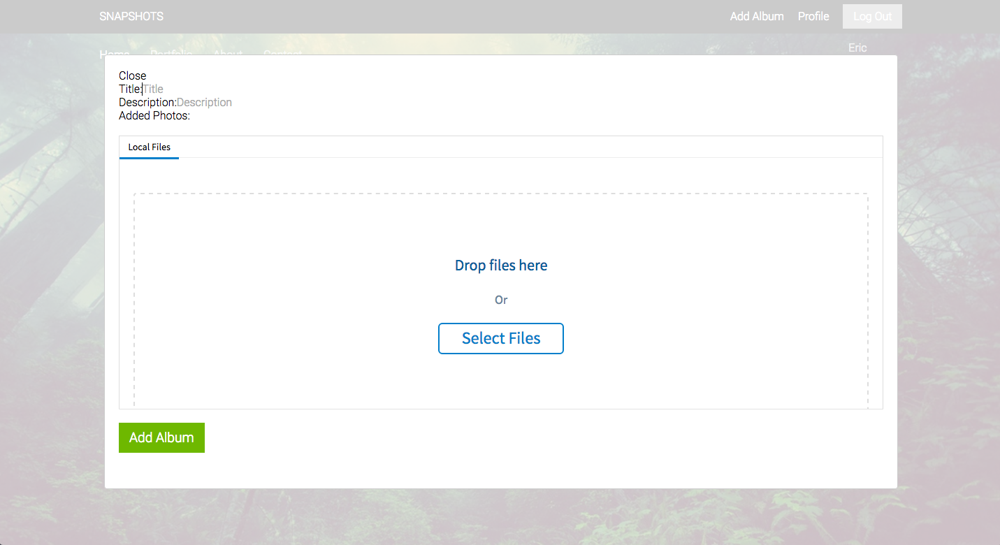
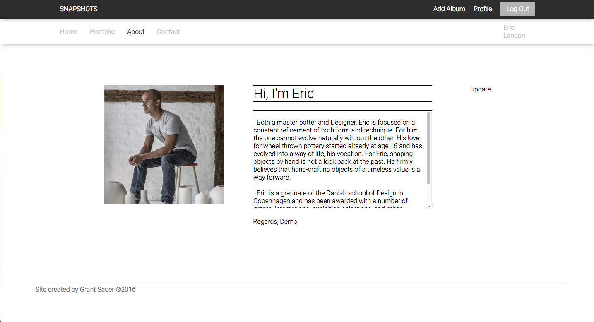
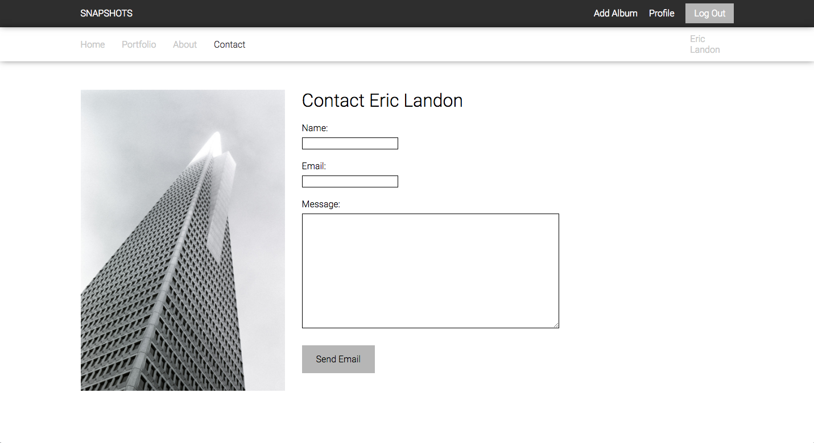

# Snapshots

[Heroku link][heroku] **NB:** Snapshots Live Link!

[heroku]: https://www.snapshots.design/

Snapshots is a full-stack web application inspired by Smugmug. It utilizes Ruby on Rails on the backend, a PostgreSQL database, and React.js with a Flux architectural framework on the frontend.

It allows for users to easily create a web portfolio by drag and dropping photos, and editing about their about me. Yup that's it and then the user has their own web portfolio!

## Features & Implementation
Listed below are the main features of my web application.

### Dynamic Photo Layout
The Layout of photos is dynamically built every time the album loads. This keeps the user's collection of work looking fresh on every load, and always with a beautiful layout.

It works by splitting the photos into rows of 1-4 photos, then calculating the correct height for the row and width for each photo to keep the aspect ratios of all the photos the same as their original. Than scales the photos to fit in the row with the correct margin between each one. No weirdly stretched photos or off margins here.

### Simple Photo Detail Allowing Photos to be Shown Without Distractions
Clicking on a photo expands the photo to a fullscreen view with a minimal interface to allow the photo to be the highlight of the view. One can use the arrow keys to view the next or previous image, as well as the escape key to go back to viewing the album.

### Easy Drag and Drop to Upload Photos
To create a album, or add photos to an album, one can simply drag and drop their photos to a photo upload modal. After the photos are uploaded, they click upload photos to create then view their new or updated album!

### Editable About Me Page
Each user can edit their about me to better reflect their personality and allows them to stand out from others portfolios besides just their artistic work.

### Contact Page
If the viewer of the person's portfolio likes their work, there is a contact tab for the fan to contact the creator of the web portfolio.

## Future Directions for the Project
Features I plan to add to the project when I have more time.

### Customizable Photo Layouts
Make it so that the user can customize their photo layouts as opposed to randomizing it each time.

### Customizable Background Photos
Make the homepage, about me, and contact page photos customizable so people can add their own.
